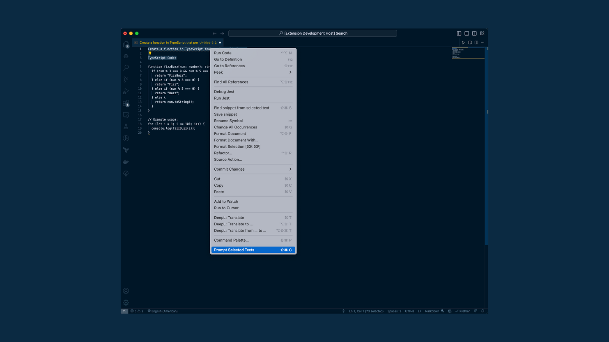

# ChatGPT Editor for VSCode

This VSCode extension allows you to use [ChatGPT](https://github.com/takagimeow/ts-chatgpt) in the editor.
You can use VSCode's editor like a big canvas and get results from ChatGPT based on what you type in the editor.

The result received from ChatGPT will be inserted at the end of the selected text.

## Links

- [Visual Studio Marketplace](https://marketplace.visualstudio.com/items?itemName=takagimeow.chatgpt-editor)
- [GitHub Repository](https://github.com/takagimeow/ts-chatgpt)

## Features

The extension provides the following features:

- Pass the text entered in the editor to ChatGPT and insert the result into the editor.
- All models offered by ChatGPT are available (including GPT4)

The following commands are available to prompt texts in the editor:

| Command                 | Keybinding    | Description                              |
| ----------------------- | ------------- | ---------------------------------------- |
| `chatgpt-editor.prompt` | `Cmd+Shift+C` | Prompt the selected texts in the editor. |

The commands are also accessible via the command palette.

In addition, the context menu is extended and now includes the prompting commands.

## Requirements

In order to use this extension, you will need an API key from OpenAI.

1. Go to [OpenAI's account page](https://platform.openai.com/account/api-keys). If you don't have an account, you will need to create one or sign up.
2. Click on the `Create new secret key` button.
3. Copy the key and paste it into the `API Key for ChatGPT` field in the extension settings.

## Extension Settings

Include if your extension adds any VS Code settings through the `contributes.configuration` extension point.

For example:

This extension contributes the following settings:

- `chatgpt-editor.apiKey`: The key is used to authenticate with the OpenAI API.

| Key                     | Description                                          | Value    |
| ----------------------- | ---------------------------------------------------- | -------- |
| `chatgpt-editor.apiKey` | The key is used to authenticate with the OpenAI API. | `xx-xx-xxx` |

For this extension to work, the above setting must be set.

Optional settings:

| Key                         | Description                                                  | Value    |
| --------------------------- | ------------------------------------------------------------ | -------- |
| `chatgpt-editor.model`      | The model used to generate texts.                            | `gpt3.5-turbo`   |
| `chatgpt-editor.temperature` | The temperature used to generate texts.                      | `0.7`    |

## Disclaimer

This extension is not an official extension of OpenAI.
The author of this extension is not affiliated with OpenAI in any way.

## Privacy Policy

The texts are generated via the online service of [ChatGPT](http://chat.openai.com/).
Please take a look at the [privacy policy](https://openai.com/policies/privacy-policy) of OpenAI.
Do not use this extension if you do not agree with the privacy policy.

## Release Notes

Users appreciate release notes as you update your extension.

### 1.0.0

Initial release of chatgpt-editor

[MIT LICENSE](LICENSE)

